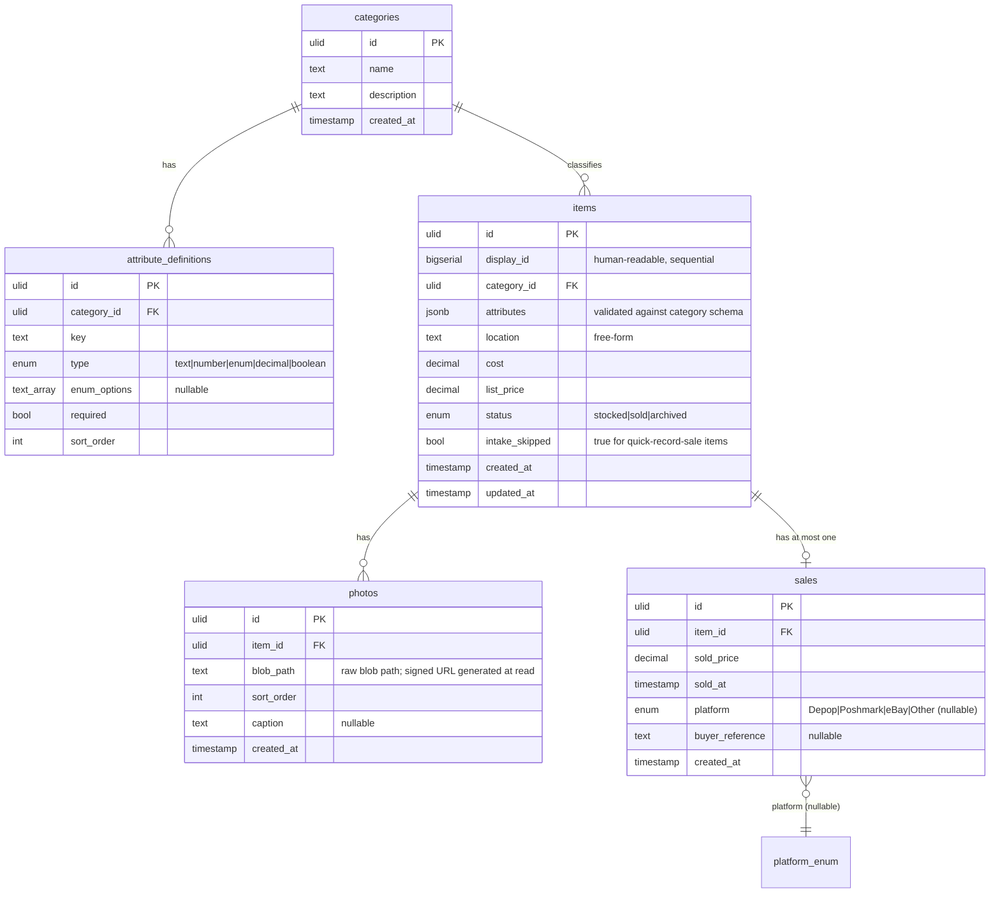
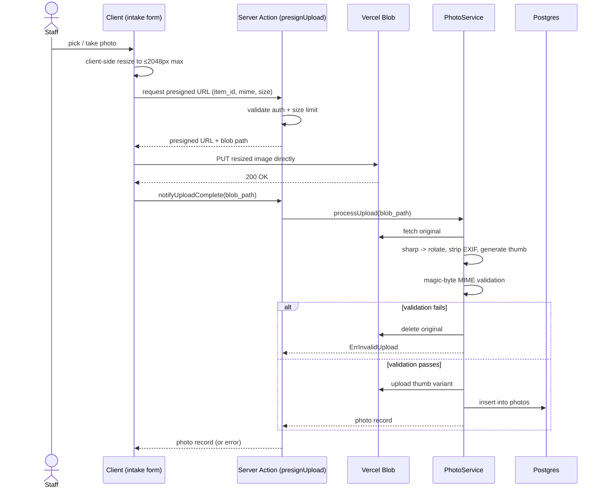
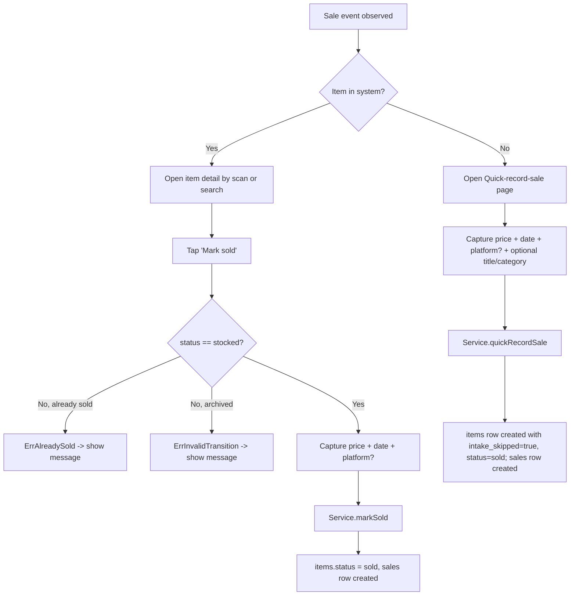

# feat: Curtis Crates Inventory Management v1

## Overview

Greenfield Next.js + Vercel + Neon application that becomes Curtis Crates' physical-inventory and intake system of record. v1 ships an internal-only tool — no SaaS scaffolding, no API surface beyond what the UI itself uses — that solves warehouse organization, label printing, and sale recording for items going forward. Cross-platform sync (Depop / Poshmark / eBay listing creation and delisting-on-sale) is explicitly v2; v1 uses a SaaS cross-listing tool as an interim mitigation for that pain.

The plan is structured into four phases that can each ship independently to Vercel, with each later phase building on the previous one. Phases 0 and 4 contain non-code planning prerequisites that must be cleared before their dependent units begin.

## Problem Frame

Curtis Crates resells clothing and Pokémon products across multiple platforms. Three compounding pains motivate this project (see origin: docs/brainstorms/2026-05-09-inventory-management-system-requirements.md):

1. Cross-platform inventory drift — addressed in v2, mitigated externally in v1.
2. Manual sale tracking — addressed by the mark-sold and quick-record-sale paths.
3. Disorganized warehouse retrieval — addressed by intake + barcode + free-form locations.

v1 commits to being honestly minimal: a phone-first intake that gets items into the system with photos, attributes, location, and a printable label, plus a single primary action to mark them sold. Listing on platforms remains outside the system in v1.

## Requirements Trace

Every requirement traces back to the origin requirements doc.

- **R1.** Every item flowing through the warehouse from launch onward gets a record (photos, attributes, location, status). Cold-start is *lazy intake on next-touch* — no big-bang migration. (origin: Success criteria #1)
- **R2.** Adding a new item including printing its label is *measurably faster* than the current baseline intake process. Baseline must be timed during planning prerequisites. (origin: Success criteria #2)
- **R3.** Printed-label barcode scans back to its item record reliably (10/10 scans). (origin: Success criteria #3)
- **R4.** Marking an item sold is a single primary action that updates the record immediately. Cross-platform delisting is expected to be manual in v1. (origin: Success criteria #4)
- **R5.** v1 is single-tenant Curtis Crates. No `org_id`, no multi-tenant scaffolding. (origin: Users + Decisions locked)
- **R6.** UI uses Next.js Server Actions; no separate JSON API surface in v1. The Service layer is the seam where v2 Route Handlers will attach. (origin: Decisions locked)
- **R7.** Item catalog uses a runtime-extensible category/attribute system: `categories` + `attribute_definitions` + per-item attribute values. Adding a category is data, not code. (origin: In scope, deliberate complexity bet)
- **R8.** Locations are a free-form `location` text field on items (no separate `locations` table in v1). (origin: In scope, simplified per scope-guardian pass)
- **R9.** Barcode + label printing via render-and-share to JADENS 268BT companion app on Jaden's phone. No Web Bluetooth. (origin: Decisions locked)
- **R10.** Mark-as-sold captures sold price, sold date, platform (nullable enum: `Depop` / `Poshmark` / `eBay` / `Other`), and optional buyer reference. (origin: In scope)
- **R11.** Quick-record-sale path for uninbound items: minimal sold record with `intake_skipped` flag, no photos / no location required. (origin: In scope)
- **R12.** Lifecycle is three states with explicitly enumerated legal transitions: `stocked → sold`, `stocked → archived`, and `sold → archived`. All other transitions raise a domain error. The Service layer enforces these. (origin: Decisions locked)
- **R13.** Auth via Auth.js magic link, allowlist of staff emails in a Vercel env var. JWT-callback re-checks the allowlist on every request so revocation-by-redeploy actually invalidates active sessions. (origin: Decisions locked + Open question 5 + 10)
- **R14.** Photo upload uses server-mediated presigned URLs to Vercel Blob. Server-side EXIF stripping (GPS removed) before persisting. Server-side MIME + magic-byte validation. Signed/expiring blob URLs for retrieval. (origin: Open question 4 + 11)
- **R15.** Internal SKU has two halves: a human-readable sequential ID (e.g. `000001`) shown on the label and in the UI, and an opaque ULID encoded in the barcode payload to prevent enumeration. (origin: Open question 3 + Risks)

## Scope Boundaries

- No cross-platform listing creation or delisting-on-sale (v2).
- No AI listing generation or image regeneration (separate project).
- No Pokémon purchase-bot or multi-account monitoring integration (separate projects; *may* integrate via an HTTP API layer added if and when those projects become real consumers — not committed in v1 or v2 unconditionally).
- No SaaS multi-tenant scaffolding, billing, or marketing site.
- No registered-location entity (free-form text field only in v1).
- No mark-listed UI action (the `listed` state is dropped from v1 lifecycle).
- No machine-client API keys, no external HTTP API surface in v1.
- No barcode scanning of legacy hand-written numbers — only labels printed by this system are guaranteed to scan.
- No Web Bluetooth code path. Render-and-share to the JADENS companion app is the only print path in v1.

### Deferred to Separate Tasks

- v2 cross-platform sync — separate plan, will introduce a `listings` child entity and the `listed` lifecycle state.
- v2 external HTTP API for agent integrations — separate plan, attaches at the Service layer.
- Slow-moving stock backfill sweep — to be scheduled ~90 days post-launch as a one-day operation, separate task.

## Context & Research

### Relevant Code and Patterns

This is a greenfield project — the working directory contains only the `docs/` folder. There is no existing code to mirror. The plan therefore introduces the entire layered architecture from the user's global CLAUDE.md (Handler / Server Action → Service → Repository / Gateway) and is responsible for setting up project conventions.

**Conventions enforced from CLAUDE.md (user global) and the project CLAUDE.md:**

- TypeScript strict, no `any`, `satisfies` over `as` (any `as` requires a `// SAFETY:` comment).
- Server Components by default; Client Components only where needed (camera, scan, label-share, BLE-not-used).
- Drizzle is the only thing that touches the database; Repositories are the only callers of Drizzle.
- Services own transaction boundaries; Repositories accept a Drizzle transaction handle.
- Functional components + hooks; colocate component + types + styles.
- Vitest + `@testing-library/react` for tests; AAA structure, one Act per test.
- Pino structured logging via a single `lib/logger.ts`; child loggers in middleware bind `requestId`.
- 80% line coverage floor.

### Institutional Learnings

No `docs/solutions/` exists yet. This project is the first chance to establish learnings — specifically, the runtime-extensible attribute pattern and the render-and-share print path are good candidates for capture once they ship.

### External References

Stack versions and version-sensitive choices the implementer should pin during Unit 1:

- Next.js 15 (App Router), React 19. Server Actions same-origin enforcement requires Next.js 13.4.4+; we are well above that floor.
- Drizzle ORM with **`drizzle-orm/neon-serverless`** + `@neondatabase/serverless`'s websocket `Pool`. (Not `neon-http` — that driver does not support `db.transaction()`, which Units 4/6/9 require.) JSONB column type with custom serializer for typed attribute values.
- Auth.js v5 (NextAuth). Magic-link Email provider; JWT session strategy with a `jwt` callback that re-validates the staff allowlist from `process.env.STAFF_ALLOWLIST` on every token refresh.
- Vercel Blob with `@vercel/blob/client` for presigned client uploads. Server-side EXIF stripping via `sharp` (rotate, resize, strip metadata) before persisting the blob URL.
- Barcode generation server-side via `bwip-js` (Code128). Barcode scanning client-side via `@zxing/browser` (works on iOS Safari and Android Chrome) — no `BarcodeDetector` API dependency.
- Label rendering via `@vercel/og` for PNG (fast cold start) or `pdfkit` for PDF if the JADENS app prefers PDF to PNG. Verified during Unit 0.1.
- ULID generation via `ulid` package; Code128 payload is the ULID string.

## Key Technical Decisions

- **Server Actions over Route Handlers for v1, with one structural exception.** v1 has zero non-UI consumers, so all UI mutations are Server Actions. The single exception: `app/api/blob/upload/route.ts`, required by `@vercel/blob/client`'s `handleUpload` model — see B3. The Service layer is still the seam — when v2 Route Handlers attach for external consumers, every Service method is reachable as a one-file-per-endpoint addition. (origin: Decisions locked + plan-review B3)
- **Server Actions are thin pass-throughs, achieved by Service-side orchestration.** Auth + parse FormData + single Service call + response. No business logic, no schema construction, no multi-service orchestration in the Server Action body. The Service layer owns dynamic schema construction (`categoryService.validateIntake`), so the action stays mechanically narrow. This preserves the v2 migration claim without requiring lint-rule enforcement at v1. (origin: feasibility-reviewer pass-2 + plan-review B5)
- **Runtime-extensible attribute system via JSONB.** Items have `category_id` + `attributes JSONB`. `categories` table holds category metadata; `attribute_definitions` table holds typed attribute schemas per category. The Service layer constructs a Zod schema dynamically from the category's attribute definitions and validates intake input against it. JSONB is queryable enough for v1 (no GIN index needed at this scale); we can add one when query patterns stabilize. (origin: In scope + feasibility pass-2)
- **No `org_id` in v1.** Schema is single-tenant. v2 SaaS pivot pays for the migration then. (origin: Decisions locked)
- **ULID in barcode, sequential ID in display.** Item table has both `display_id` (zero-padded sequential, generated by a Postgres sequence) and `id` (ULID, primary key). Barcode encodes `id`; label and UI show `display_id`. Scan-by-id resolves back via the primary key. **All URL routes (`/items/[id]`) use the ULID `id`, never `display_id`.** `display_id` is staff-facing only (printed on labels, shown in catalog cards) and never appears in any route, query string, or API path. Prevents catalog enumeration from a single label. (origin: Open question 3 + security pass-1)
- **Render-and-share is the only print path in v1.** Server Action returns a presigned blob URL pointing to a server-rendered label PNG. Client component opens it via `navigator.share({ files: [...] })` (or falls back to a download link if the platform doesn't support file share). JADENS protocol is irrelevant to v1 — the verification gate is that the companion app accepts the rendered file format. (origin: Decisions locked + adversarial pass-2)
- **Magic-link + JWT with middleware-level allowlist enforcement.** Auth.js v5 with the Email provider; JWT session strategy; magic links are single-use and 15-minute TTL (Auth.js default). The per-request allowlist gate lives in `src/middleware.ts` (which DOES run per request), not in the jwt callback (which doesn't). Middleware decodes the session via `auth()`, looks up the email in the parsed `STAFF_ALLOWLIST` Set, and on mismatch calls `signOut()` and redirects to `/sign-in`. Session JWT TTL is 24 hours as a defense-in-depth ceiling, but the actual revocation latency is "next request after Vercel redeploy completes" (~30s). (origin: Open questions 5 + 10 + plan-review B1)
- **Photo pipeline: `handleUpload` Route Handler → server-side EXIF strip → DB write.** `@vercel/blob/client.upload()` posts to `app/api/blob/upload/route.ts`. `onBeforeGenerateToken` does the auth check and verifies the requesting staff member is uploading to an item that exists with status `stocked`. `onUploadCompleted` triggers `PhotoService.completeUpload`, which fetches the original blob, strips EXIF + rotates + resizes via `sharp` (max 2048px), validates MIME via magic bytes, writes the resulting **blob path** (not signed URL) to the `photos` table. **No thumbnail variant in v1** — catalog cards use the original with CSS sizing; revisit if measured catalog perf is a problem. The Service layer generates time-limited signed URLs from blob paths on every read (default 1h TTL); the database never stores stale URLs. Failure → blob is deleted. (origin: Open question 4 + 11 + plan-review B3 + scope-guardian S3)
- **Status transitions enforced in Service.** Legal: `stocked → sold`, `stocked → archived`, `sold → archived`. Illegal transitions raise a domain error (`ErrInvalidTransition` / `ErrAlreadySold`) the Server Action surfaces as a user-visible message. No idempotency contract beyond "second mark-sold returns ErrAlreadySold." (origin: Open question 6 + decisions locked)
- **Logging: Pino + child loggers bound to `requestId` in middleware.** Single `lib/logger.ts`. Server Actions and Service methods accept a logger instance via context. PII redacted via Pino config, not call sites.
- **No OTel / Langfuse in v1.** The user's CLAUDE.md mandates these for production but v1 is internal-only with one consumer; defer until v2 brings external traffic. Note this as a deviation. (origin: not in scope; decided here)

## Open Questions

### Resolved During Planning

- *SKU format split.* `display_id` = sequential, `id` = ULID. Barcode encodes ULID; label shows both.
- *Photo upload model.* Presigned URL to Vercel Blob, server-side EXIF strip via `sharp`. Signed/expiring URLs for retrieval.
- *Auth provider.* Auth.js v5 Email provider + custom `jwt` callback for allowlist re-check.
- *Server Actions vs Route Handlers.* Server Actions for v1, Route Handlers added only when v2 brings a real second consumer.
- *Lifecycle states.* Three states: `stocked`, `sold`, `archived`. Plus an `intake_skipped` boolean flag for quick-record-sale items.
- *Scan-no-match disambiguation.* Scan a barcode that doesn't match any record → route to a disambiguation screen with two CTAs: "Quick-record this sale" and "Start intake with this code as the SKU." Default-no-action.
- *Free-form sanitization.* React's default text rendering is XSS-safe; the only at-risk surface is the label preview which uses `@vercel/og` (also safe by default — it does not interpret arbitrary HTML). Length caps applied via Zod.

### Deferred to Implementation

- *Exact JSONB query patterns for category-attribute filtering.* The shape of "find all clothing items with size M" is decided when the catalog list view is built (Unit 7). May add a GIN index on `attributes` if query plans show it's needed.
- *Server Action body-size handling.* Photos go via presigned upload; non-photo Server Actions stay well under Vercel's 1MB body cap. Confirmed during Unit 6.
- *`@vercel/og` vs `pdfkit` for label rendering.* PNG via `@vercel/og` is the default. If the JADENS app prefers PDF, switch to `pdfkit`. Decided after Unit 0.1 verification.
- *Catalog list view density and filters.* Specific UI decisions (filter chips, sort order, photo size in list view) made during Unit 7.

### Deferred to Planning Prerequisites (must clear before Phase 4)

- *JADENS 268BT end-to-end render-and-share verification.* See Unit 0.1.
- *Current intake baseline timing.* See Unit 0.2.
- *Three-state lifecycle confirmation with Jaden.* Brief conversation, not a unit.

### Critical Architectural Decisions Surfaced in Plan Review (resolved 2026-05-09)

These were not visible at brainstorm time and were resolved during the plan-review pass. Each affects multiple implementation units; treat the resolutions below as authoritative.

**B1. Auth.js v5 jwt callback is NOT per-request → use middleware-level allowlist check.** The earlier plan implied per-request revocation via the jwt callback. That's incorrect — jwt callback fires only on token creation and refresh. **Resolved:** the per-request allowlist check moves into `src/middleware.ts`. Middleware decodes the session via `auth()`, looks up the email against the parsed `STAFF_ALLOWLIST` Set, and on mismatch calls `signOut()` (clearing the session cookie) and redirects to `/sign-in`. The jwt callback can stay as a defense-in-depth secondary check but is not the primary gate. Revocation latency becomes "next request after Vercel redeploy completes" rather than "next request unconditionally" — which still beats the 24h TTL claim and avoids needing a DB `users` table. The runbook should advertise revocation SLA as "within ~30 seconds of redeploy completion" not "24h."

**B2. Drizzle driver → switch to `drizzle-orm/neon-serverless` (websocket Pool).** `neon-http` is stateless and does not support `db.transaction()` or row locks; Units 4, 6, 9 all need atomic multi-statement writes. **Resolved:** Unit 1 + Unit 3 use `drizzle-orm/neon-serverless` with `@neondatabase/serverless`'s `Pool`. `db/client.ts` exports a `createDb(config)` factory that returns a Drizzle client wrapping a Pool connection. Cost: a slight cold-start increase per function invocation (websocket handshake) — acceptable for a low-throughput single-warehouse system.

**B3. Vercel Blob → one Route Handler exception.** `@vercel/blob/client.upload()` posts to a Route Handler that runs `handleUpload({ onBeforeGenerateToken, onUploadCompleted })`. **Resolved:** the architecture has exactly one Route Handler exception at `src/app/api/blob/upload/route.ts`. `onBeforeGenerateToken` does the auth check and verifies the staff member is uploading to an item that exists and has status `stocked`; `onUploadCompleted` is called by Vercel with the verified blob path and triggers `PhotoService.completeUpload`. The client-supplied path is never trusted (closes B4 — path injection risk). Local development uses Vercel CLI tunneling for `onUploadCompleted`; for non-tunneled dev a fallback path (server-side polling or a dev-only direct Server Action) is acceptable.

**B4. Photo pipeline path-injection — auto-resolved by B3.** `handleUpload`'s server-side path issuance and Vercel-callback model mean the client never supplies a path. Closed.

**B5. Server Action thin-pass-through enforcement → restructure the Service interface.** The plan's "thin pass-through" claim has been at risk because Unit 7's Server Action constructs a Zod schema from category definitions before calling the Service. **Resolved:** move that orchestration into the Service. `categoryService` exposes `validateIntake(categoryId, input): ValidatedItemInput` which encapsulates fetch-definitions + build-schema + parse. The Server Action becomes literally `auth → parse FormData → categoryService.validateIntake → itemService.createItem → revalidatePath('/(warehouse)') → return display_id`. The interface is naturally narrow; v2 Route Handlers attach with no Service reshaping. (No CI lint rule needed at v1 — re-evaluate at v2 if the discipline drifts in practice.)

**B6. Unit 0.1 verification scope expanded.** **Resolved:** Unit 0.1 now compares three end-to-end print paths on Jaden's actual phone (see updated Unit 0.1).

## Output Structure

```
src/
├── app/                              # Next.js App Router
│   ├── (auth)/
│   │   └── sign-in/page.tsx          # magic-link request + sent confirmation
│   ├── (warehouse)/
│   │   ├── layout.tsx                # auth guard, requestId middleware integration
│   │   ├── page.tsx                  # catalog list (Server Component)
│   │   ├── intake/
│   │   │   └── page.tsx              # mobile-first intake form
│   │   ├── items/
│   │   │   └── [id]/page.tsx         # item detail (mark-sold, archive, reprint)
│   │   ├── scan/
│   │   │   └── page.tsx              # camera scan landing
│   │   └── quick-sale/
│   │       └── page.tsx              # uninbound-item sale recording
│   ├── api/
│   │   ├── auth/[...nextauth]/route.ts   # Auth.js v5 handlers
│   │   └── blob/upload/route.ts          # Vercel Blob handleUpload (only Route Handler exception)
│   └── actions/
│       ├── intake.ts                 # createItem Server Action
│       ├── sale.ts                   # markSold + quickRecordSale Server Actions
│       ├── archive.ts                # archiveItem Server Action
│       └── label.ts                  # renderLabel Server Action
├── components/
│   ├── intake/                       # IntakeForm, AttributeFields, PhotoCapture
│   ├── catalog/                      # CatalogList, ItemCard, FilterBar
│   ├── item/                         # ItemDetail, MarkSoldDialog, ArchiveDialog
│   ├── scan/                         # BarcodeScanner (Client Component)
│   ├── label/                        # LabelShareTrigger (Client Component)
│   └── ui/                           # primitives
├── services/
│   ├── item.service.ts               # business logic: createItem, markSold, archive, quickRecordSale
│   ├── category.service.ts           # category + validateIntake (dynamic Zod schema build + parse)
│   ├── photo.service.ts              # photo pipeline orchestration
│   └── label.service.ts              # label payload composition
├── repositories/
│   ├── item.repository.ts
│   ├── category.repository.ts
│   ├── attribute_definition.repository.ts
│   ├── photo.repository.ts
│   └── sale.repository.ts            # sales row CRUD (called by item.service)
├── gateways/
│   └── blob.gateway.ts               # Vercel Blob presign + EXIF strip wrapper
├── domain/
│   ├── item.ts                       # Item, ItemStatus, Display/ULID id types
│   ├── category.ts                   # Category, AttributeDefinition, AttributeValue
│   ├── photo.ts                      # Photo with variants
│   ├── sale.ts                       # Sale, SoldPlatform enum (nullable)
│   └── errors.ts                     # ErrAlreadySold, ErrInvalidTransition, etc.
├── lib/
│   ├── logger.ts                     # Pino + child binder
│   ├── auth.ts                       # Auth.js v5 config + jwt callback
│   ├── attributes.ts                 # dynamic Zod schema builder from definitions
│   └── ulid.ts                       # ULID generation helper
├── db/
│   ├── schema.ts                     # Drizzle schema (single source)
│   ├── client.ts                     # Drizzle client factory
│   └── seed/
│       └── categories.ts             # Clothing + Pokémon Sealed + Pokémon Single seed
└── instrumentation.ts                # placeholder for v2 OTel
drizzle/
└── migrations/                       # generated Drizzle migrations
tests/
└── (mirrors src/)                    # Vitest test files
```

## High-Level Technical Design

> *This illustrates the intended approach and is directional guidance for review, not implementation specification. The implementing agent should treat it as context, not code to reproduce.*

### Data model (entity-relationship sketch)



### Photo upload sequence



### Mark-sold + quick-record-sale flow



## Implementation Units

### Phase 0: Planning prerequisites (no code)

- [ ] **Unit 0.1: JADENS render-and-share end-to-end verification**

**Goal:** Confirm the JADENS 268BT companion app on Jaden's actual phone reliably accepts and prints a label payload (PNG and/or PDF) shared from a phone share sheet. This is the gate for the entire printing implementation.

**Requirements:** R3, R9

**Dependencies:** None

**Files:** None — this is a manual verification step.

**Approach:**
- Generate two test 4×6 labels — one PNG, one PDF — each containing a Code128 barcode of a known ULID and placeholder text "TEST 000001".
- Compare three end-to-end print paths on Jaden's actual phone:
  1. **`navigator.share({ files })`:** open a small test page in mobile Safari and Chrome that triggers `navigator.share({ files: [pngFile] })`; observe whether the JADENS app appears as a share target and whether the share completes.
  2. **System print dialog (AirPrint / Android Default Print):** pair the JADENS printer to the phone as a system printer (if supported by the JADENS app); from a browser print dialog, send the PDF.
  3. **Download → open-in-app:** download the PNG/PDF from the browser; open the saved file via the Files / Photos app and tap "Open in JADENS"; print.
- For each path, attempt 5 prints. Record: success rate, time-from-tap-to-print, whether the printed barcode scans back to the source ULID (10/10 target), and whether the path works on both iOS Safari and Android Chrome.

**Verification:**
- One of the three paths achieves 5/5 prints with 10/10 barcode scan-back. That path becomes the v1 primary.
- The other two paths are documented as available fallbacks (or as confirmed-broken if so).
- Unit 11 implements only the chosen primary path; the dual-codepath pattern is rejected.
- If all three paths fail or are unreliable, the v1 print plan switches to: render PDF, route through any AirPrint or USB-attached non-JADENS printer in the warehouse. Document the chosen path in this verification's outcome before proceeding to Phase 4.

- [ ] **Unit 0.2: Current intake baseline timing**

**Goal:** Anchor R2 to a measurable baseline.

**Requirements:** R2

**Dependencies:** None

**Files:** None — manual measurement, recorded in the requirements doc or an addendum.

**Approach:**
- With Jaden, time the existing intake process end-to-end on three typical garments: take photos, write the ID by hand, place in box, record location wherever it currently lives.
- Average the three. Record both the mean and the longest single time.

**Verification:**
- A specific number-of-seconds baseline is written down. R2 success target becomes "intake including label print is faster than baseline by at least 5 seconds" (5s being a reasonable margin given the cost of writing the ID by hand the old way).

### Phase 1: Foundation

- [x] **Unit 1: Project scaffolding and deploy pipeline** *(shipped 2026-05-09)*

**Goal:** Establish the Next.js + Bun + TypeScript-strict project, wired to Vercel and Neon, with the layered architecture skeleton in place.

**Requirements:** R5, R6

**Dependencies:** None

**Files:**
- Create: `package.json`, `bun.lockb`, `tsconfig.json`, `next.config.ts`, `.env.example`
- Create: `src/app/layout.tsx`, `src/app/page.tsx` (placeholder), `src/instrumentation.ts` (placeholder)
- Create: `src/lib/logger.ts`
- Create: `vitest.config.ts`, `tsconfig.test.json`
- Create: empty directories for `src/services/`, `src/repositories/`, `src/gateways/`, `src/domain/`, `src/db/`, `tests/`
- Create: `.github/workflows/ci.yml` (lint + typecheck + test on PR)
- Create: `vercel.json` if framework auto-detection isn't sufficient

**Approach:**
- Initialize with `bun create next-app` (TypeScript strict, App Router, no Tailwind unless the user prefers — defer until UI work in Unit 7).
- Configure `tsconfig.json` to match the user's CLAUDE.md (`strict: true`, `noUncheckedIndexedAccess: true`).
- Add ESLint + Prettier per project conventions.
- Set up Vitest with `@testing-library/react`. Add a smoke test (`tests/smoke.test.ts`) that imports `lib/logger` and asserts it constructs.
- `lib/logger.ts`: Pino with a single root logger; export `createChildLogger(requestId, userId?)` factory.
- Create a Neon project, get the connection string, wire it into `.env.example` (do not commit a real value). Connect to Vercel.
- CI workflow: `bun install`, `bun run lint`, `bun run typecheck`, `bun run test`.

**Patterns to follow:**
- User CLAUDE.md file structure: `src/{app, components, services, repositories, gateways, lib, db}/`.
- Server Components by default.

**Test scenarios:**
- *Happy path: smoke* — Logger module imports without throwing; `createChildLogger("req-1")` returns a logger with `requestId: req-1` bound.
- *Edge case: missing env* — When `DATABASE_URL` is unset, the app should fail to start with a clear error rather than silently misbehaving (verified by a smoke test that imports `db/client` with an empty env).

**Verification:**
- `bun run dev` boots locally. Vercel preview deploys succeed on a PR.
- CI runs lint + typecheck + test on PRs and passes on this scaffold.

- [x] **Unit 2: Authentication via Auth.js v5 + magic link + env allowlist** *(shipped 2026-05-09)*

**Goal:** Single-tenant authentication where only emails on the allowlist can sign in, and removing an email from the allowlist invalidates active sessions within the JWT TTL.

**Requirements:** R5, R13

**Dependencies:** Unit 1

**Execution note:** Test-first for the JWT callback's allowlist re-check — this is a security boundary and should be characterized before being written.

**Files:**
- Create: `src/app/api/auth/[...nextauth]/route.ts` — Auth.js handlers
- Create: `src/lib/auth.ts` — `authOptions` config, allowlist parsing, jwt callback
- Create: `src/app/(auth)/sign-in/page.tsx` — magic link request form (Server Action)
- Create: `src/app/(auth)/sign-in/sent/page.tsx` — "check your email" confirmation
- Create: `src/middleware.ts` — auth guard for `(warehouse)` routes
- Modify: `.env.example` — add `STAFF_ALLOWLIST`, `AUTH_SECRET`, `EMAIL_SERVER_*`
- Test: `tests/lib/auth.test.ts`

**Approach:**
- Auth.js v5 with the Email provider configured for magic links (15-minute TTL, single-use).
- `STAFF_ALLOWLIST` is a comma-separated env var of staff email addresses. `lib/auth.ts` parses it once at module load into a `Set<string>` for O(1) lookups; parsing is exposed for testing.
- JWT session strategy. Session TTL: 24 hours (defense-in-depth ceiling).
- **Per-request allowlist enforcement lives in `middleware.ts`, not the jwt callback.** Middleware decodes the session via `auth()`, looks up the email in the parsed allowlist Set, and on mismatch calls `signOut()` (clearing the cookie) and redirects to `/sign-in`. This is the actual revocation gate; the jwt callback is at most a defense-in-depth secondary check.
- `middleware.ts` also redirects unauthenticated requests under `(warehouse)` to `/sign-in`.
- Revocation latency: "next request after Vercel redeploy completes" (~30s in practice), bounded above by 24h JWT TTL.

**Patterns to follow:**
- Auth.js v5 conventions for the Email provider configuration.
- Project layered architecture: middleware → auth check → Server Action / page.

**Test scenarios:**
- *Happy path: allowlisted user gets a session* — Email on `STAFF_ALLOWLIST` requests a magic link; clicking the link results in a valid session; subsequent requests carry the JWT.
- *Error path: non-allowlisted email* — Email not on `STAFF_ALLOWLIST` requests a magic link; `signIn` returns false / the link sign-in is rejected; no session is created.
- *Error path: removed email mid-session* — User signs in (session valid). Allowlist env var is changed and Vercel redeploy completes. On the user's next request, middleware re-parses the allowlist, fails the lookup, calls `signOut()`, clears the session cookie, and redirects to `/sign-in`. Test asserts the cookie is cleared, not just that "session is invalidated."
- *Edge case: malformed allowlist* — Empty string, whitespace-only, duplicate entries — parsing should return a clean Set; tests should assert behavior for each.
- *Error path: expired magic link* — Link clicked after 15 minutes returns an "expired link" error and prompts for a new one.
- *Error path: replayed magic link* — Magic link clicked twice; second use is rejected as already-consumed.
- *Integration: middleware redirect* — Unauthenticated request to `/items/abc` redirects to `/sign-in?callbackUrl=/items/abc`.

**Verification:**
- An email in the env allowlist can sign in via magic link end-to-end on a Vercel preview.
- An email removed from the env allowlist (after a redeploy) loses access within one request after their JWT next refreshes.

- [x] **Unit 3: Drizzle schema, migrations, and category seed data** *(shipped 2026-05-09)*

**Goal:** Stand up the entire v1 data model (items, categories, attribute_definitions, photos, sales) with a first migration applied to Neon and the three v1 categories seeded.

**Requirements:** R7, R8, R10, R11, R12, R15

**Dependencies:** Unit 1

**Files:**
- Create: `src/db/schema.ts` — full Drizzle schema
- Create: `src/db/client.ts` — Neon HTTP / Pool client factory
- Create: `src/db/seed/categories.ts` — Clothing, Pokémon Sealed, Pokémon Single seed
- Create: `drizzle.config.ts`
- Create: initial Drizzle migration file (generated)
- Test: `tests/db/schema.test.ts` — schema-shape assertions, transition guards via SQL constraints

**Approach:**
- `items` table: `id` ULID PK, `display_id` `bigserial` (unique, sequential), `category_id` FK, `attributes` JSONB (default `{}`), `location` text (nullable for `intake_skipped` items), `cost` numeric (nullable for quick-record-sale), `list_price` numeric (nullable), `status` enum (`stocked` | `sold` | `archived`), `intake_skipped` boolean default false, `created_at` / `updated_at` timestamps.
- `categories` table: `id` ULID PK, `name` text unique, `description` text, `created_at`.
- `attribute_definitions` table: `id` ULID PK, `category_id` FK, `key` text, `type` enum (`text` | `number` | `enum` | `decimal` | `boolean`), `enum_options` text[], `required` boolean, `sort_order` integer. Unique on `(category_id, key)`.
- `photos` table: `id` ULID PK, `item_id` FK (cascade delete), `original_url` text, `thumb_url` text, `sort_order` integer, `caption` text nullable, `created_at`.
- `sales` table: `id` ULID PK, `item_id` FK unique (one sale per item), `sold_price` numeric, `sold_at` timestamp, `platform` enum (`Depop` | `Poshmark` | `eBay` | `Other`) nullable, `buyer_reference` text nullable, `created_at`.
- Postgres CHECK constraints: `items.status` transitions enforced in Service layer (not DB) since CHECK constraints can't reference previous row state without triggers; instead, add `items.intake_skipped` constraint that requires `status = 'sold'` when `intake_skipped = true`.
- Seed data: Clothing (attributes: brand, style, size, condition, pit_to_pit, inseam, color), Pokémon Sealed (attributes: set, product_type, edition), Pokémon Single (attributes: set, card_number, condition, graded, grade).

**Patterns to follow:**
- Project CLAUDE.md: SQL files / migrations are source of truth. Drizzle generates from `schema.ts`; no hand edits to migrations.

**Test scenarios:**
- *Happy path: insert a stocked Clothing item* — All required columns + a valid attributes JSONB → row inserted; `display_id` auto-increments; `id` is a valid ULID.
- *Edge case: attributes JSONB shape* — Insert with `attributes = { brand: "Nike", size: "M" }` succeeds; the schema does not constrain shape (Service layer validates against attribute_definitions, not the DB).
- *Error path: invalid status enum* — Insert with `status = 'listed'` fails — `'listed'` is not in the v1 enum.
- *Error path: intake_skipped without sold status* — Insert with `intake_skipped = true, status = 'stocked'` fails the CHECK constraint.
- *Edge case: cascade delete photos on item delete* — Delete an item → its photos rows are deleted; sales row is preserved (so we don't accidentally lose sale history).
- *Integration: seed runs idempotently* — Running `seed/categories.ts` twice does not duplicate rows (uses `INSERT ... ON CONFLICT DO NOTHING` on category name).

**Verification:**
- `bunx drizzle-kit migrate` applies cleanly against a fresh Neon branch.
- `bun run db:seed` produces the three v1 categories with their attribute definitions.
- `bun run db:studio` displays the populated schema.

### Phase 2: Catalog backbone (services, repositories, photo pipeline)

- [ ] **Unit 4: Item repository + service with status transition enforcement**

**Goal:** Item CRUD + status transitions via the Service layer. Repository owns Drizzle; Service owns business rules.

**Requirements:** R6, R10, R12

**Dependencies:** Unit 3

**Execution note:** Test-first per project convention for service-layer business logic.

**Files:**
- Create: `src/repositories/item.repository.ts`
- Create: `src/repositories/sale.repository.ts` — sales row CRUD, called by item.service from inside transactions
- Create: `src/services/item.service.ts` — owns createItem, markSold, archive, quickRecordSale
- Create: `src/domain/item.ts` — `Item`, `ItemStatus`, ULID/display id types
- Create: `src/domain/errors.ts` — `ErrAlreadySold`, `ErrInvalidTransition`, `ErrNotFound`, `ErrValidation`
- Test: `tests/services/item.service.test.ts`
- Test: `tests/repositories/item.repository.test.ts`

**Approach:**
- Repository: `findById` (ULID PK lookup — used by barcode scan and route resolution), `findByDisplayId` (sequential ID lookup — used by staff search), `listStocked`, `listAll(filters)`, `create(input, tx?)`, `update(id, patch, tx?)`, `setStatus(id, status, tx?)`. All accept an optional Drizzle transaction.
- Service: `createItem(input)`, `markSold(id, saleInput)`, `archive(id, reason)`, `quickRecordSale(input)`. (Note: `quickRecordSale` lives here, not in a separate `sale.service.ts`, per scope-cleanup S6.) Service opens a transaction for `markSold` (insert into `sales` + update `items.status`) and for `quickRecordSale` (insert items + insert sales) so partial writes are impossible. **Transactions are real `db.transaction()` calls — viable now that B2 chose `drizzle-orm/neon-serverless`.**
- Status transitions: `stocked → sold`, `stocked → archived`, `sold → archived`. Anything else throws `ErrInvalidTransition`. `markSold` on `sold` throws `ErrAlreadySold`.
- Service receives a logger via context for structured event logs (`item.created`, `item.sold`, `item.archived`).

**Patterns to follow:**
- Layered architecture: Service depends on Repository interface; concrete Repo wired at composition root.
- Service interface defined where consumed (handler/Server Action), not where implemented.

**Test scenarios:**
- *Happy path: create a stocked item* — Valid input → item is created with `status = stocked`, `display_id` increments.
- *Happy path: mark a stocked item sold* — Valid sale input → item is updated to `sold`, sale row created, transaction commits atomically.
- *Error path: mark sold an already-sold item* → throws `ErrAlreadySold`.
- *Error path: mark sold an archived item* → throws `ErrInvalidTransition`.
- *Error path: archive a sold item* — Allowed; status goes `sold → archived`. Sale row is preserved.
- *Error path: archive an already-archived item* → throws `ErrInvalidTransition`.
- *Edge case: concurrent mark-sold* — Two concurrent `markSold` calls on the same `stocked` item; one wins (transaction + row lock), the other gets `ErrAlreadySold`.
- *Integration: transactional rollback* — If sale insert fails (constraint violation simulated), item status is not updated.

**Verification:**
- All tests pass with race detector / parallel test execution enabled.
- Status transition matrix is exhaustively covered.

- [ ] **Unit 5: Category service + dynamic Zod schema builder for attributes**

**Goal:** Categories and attribute definitions are queryable; intake input can be validated against a category-specific Zod schema constructed at runtime.

**Requirements:** R7

**Dependencies:** Unit 3

**Files:**
- Create: `src/repositories/category.repository.ts`
- Create: `src/repositories/attribute_definition.repository.ts`
- Create: `src/services/category.service.ts`
- Create: `src/lib/attributes.ts` — `buildZodSchema(definitions: AttributeDefinition[]): ZodSchema`
- Create: `src/domain/category.ts`
- Test: `tests/lib/attributes.test.ts`
- Test: `tests/services/category.service.test.ts`

**Approach:**
- `buildZodSchema` constructs a `z.object({...})` from an array of attribute definitions. Type mapping: `text → z.string()`, `number → z.number()`, `decimal → z.number()` (later refined for precision), `boolean → z.boolean()`, `enum → z.enum(definition.enum_options)`. `required` → not optional; otherwise `.optional()`.
- Length caps applied via `.max(N)` per type — text fields max 200 chars, enum options max 50 chars (label-rendering constraint). Same caps apply to free-form `location` and `buyer_reference` fields elsewhere in the system.
- **`categoryService.validateIntake(categoryId, rawInput)`** is the public Service surface used by the intake Server Action. It encapsulates: fetch category + definitions → `buildZodSchema(definitions)` → `schema.parse(rawInput)` → return `ValidatedItemInput` (typed). On failure throws `ErrValidation` with field-level details. This single method is what keeps the Server Action a thin pass-through (B5 resolution) — the action does not know about Zod or attribute_definitions.
- Pure functions in `lib/attributes.ts` are heavily unit-tested.

**Patterns to follow:**
- Functional builder, not class-based. Project CLAUDE.md mandates strict types.

**Test scenarios:**
- *Happy path: build schema for Clothing* — Given Clothing's attribute definitions, `buildZodSchema` produces a schema where `parse({ brand: "Nike", size: "M", pit_to_pit: 22 })` succeeds.
- *Happy path: build schema for Pokémon Single* — Builds a schema where `parse({ set: "Base", card_number: "4/102", condition: "NM", graded: false })` succeeds.
- *Error path: missing required attribute* — Input missing a required attribute → ZodError surfaces the missing key.
- *Error path: wrong type* — `parse({ pit_to_pit: "twenty-two" })` for a number-typed attribute → ZodError.
- *Error path: invalid enum value* — `parse({ condition: "Mint" })` when enum is `["NM", "LP", "MP", "HP"]` → ZodError.
- *Edge case: no attribute definitions* — Empty array → schema is `z.object({})` (no constraints; any input passes).
- *Edge case: text length cap* — Text attribute over 200 chars → ZodError.

**Verification:**
- Coverage on `lib/attributes.ts` is 95%+ (this is pure logic).
- Service can fetch a category and return a usable Zod schema in <50ms for typical attribute counts.

- [ ] **Unit 6: Photo upload pipeline (presigned + EXIF strip + thumbnails)**

**Goal:** Phone-captured photos land in Vercel Blob via the `handleUpload` Route Handler, get EXIF-stripped server-side, and produce a single-variant `photos` row whose blob path is signed at read time.

**Requirements:** R14

**Dependencies:** Unit 3

**Files:**
- Create: `src/app/api/blob/upload/route.ts` — Vercel Blob `handleUpload` route (only Route Handler exception in v1)
- Create: `src/gateways/blob.gateway.ts` — `processUploadedBlob(blobPath)` (fetch + EXIF strip + magic-byte validate), `getSignedUrl(blobPath, ttl)`, `deleteBlob(blobPath)`
- Create: `src/services/photo.service.ts` — `completeUpload(blobPath, itemId)` invoked by `onUploadCompleted`
- Create: `src/repositories/photo.repository.ts`
- Create: `src/domain/photo.ts`
- Test: `tests/app/api/blob/upload.test.ts` — auth check + ownership check on `onBeforeGenerateToken`
- Test: `tests/services/photo.service.test.ts`
- Test: `tests/gateways/blob.gateway.test.ts`

**Approach:**
- `app/api/blob/upload/route.ts` runs `handleUpload({ onBeforeGenerateToken, onUploadCompleted })`:
  - `onBeforeGenerateToken({ pathname, clientPayload })`: authenticates the request via `auth()`, parses `clientPayload` (which carries the target `itemId`), verifies the item exists and has status `stocked`, validates declared MIME (whitelist `image/jpeg`/`image/png`/`image/webp`) and declared size (max 10MB), and returns the token + the server-issued path. The client never supplies the path.
  - `onUploadCompleted({ blob, tokenPayload })`: invokes `PhotoService.completeUpload(blob.url, itemId)`.
- `BlobGateway.processUploadedBlob(blobPath)`: pulls the original blob, runs `sharp().rotate().resize({ width: 2048, withoutEnlargement: true }).withMetadata({ exif: false }).toBuffer()`. Validates magic bytes match the declared MIME. On any failure, calls `deleteBlob` and throws `ErrInvalidUpload`. **No thumbnail variant** — catalog cards use the original with CSS sizing (`max-width`); revisit only if measured catalog perf demands a separate thumb.
- `PhotoService.completeUpload`: orchestrates gateway call + repository insert in one Service method (single transaction not strictly needed since there's only one DB row, but the gateway-then-DB ordering ensures we don't insert a row pointing at a non-existent processed blob).
- `getSignedUrl(blobPath, ttl)`: returns a signed URL with default 1-hour TTL. Catalog and item detail views call this on every read; the DB stores only the raw blob path.
- **No client-side canvas resize** — `handleUpload` direct-to-Blob upload bypasses Vercel Function body limits anyway, so the workaround is unnecessary. The server-side `sharp` step caps the persisted variant at 2048px.

**Patterns to follow:**
- Gateway normalizes vendor responses into Domain types (Photo). Service is the only caller.
- Repository inserts; never opens its own transactions.

**Test scenarios:**
- *Happy path: handleUpload round-trip* — Authenticated client calls `upload()`; `onBeforeGenerateToken` issues the token; client uploads; `onUploadCompleted` invokes `PhotoService.completeUpload`; a photo row exists with the processed blob path.
- *Error path: unauthenticated upload* — Client without a valid session calls `upload()`; `onBeforeGenerateToken` throws; no token issued, no upload occurs.
- *Error path: item ownership mismatch* — Authenticated client tries to upload to an `itemId` that doesn't exist or has status `archived`/`sold`; `onBeforeGenerateToken` rejects.
- *Error path: invalid MIME declared* — `clientPayload.mime = 'image/svg+xml'` → `onBeforeGenerateToken` rejects.
- *Error path: oversized declaration* — `clientPayload.size = 50MB` → `onBeforeGenerateToken` rejects.
- *Error path: magic byte mismatch on completion* — Upload claims `image/jpeg` but bytes are PNG → `processUploadedBlob` deletes blob, throws `ErrInvalidUpload`, no photos row created.
- *Edge case: EXIF GPS removed* — Source image with GPS EXIF → persisted variant has no GPS metadata (assert via `sharp().metadata()` round-trip).
- *Edge case: orientation-corrected* — Image with EXIF rotation flag → persisted variant is correctly rotated and rotation flag stripped.
- *Integration: signed URL retrieval* — `getSignedUrl` returns a URL that fetches successfully within the TTL and 401s after.
- *Edge case: localhost dev fallback* — Document (and test if practical) the localhost path: when `onUploadCompleted` callback won't reach the local dev server without a tunnel, dev mode falls back to a manual completion trigger (or relies on Vercel CLI tunneling). Not a runtime test — a documented runbook step.

**Verification:**
- An end-to-end upload from a phone preview deploy results in a photos row with stripped-EXIF original and thumbnail variants.
- A test image with embedded GPS produces a stored variant with no GPS metadata.

### Phase 3: UI — intake, catalog, sale recording

- [ ] **Unit 7: Mobile-first intake flow + Server Action wiring**

**Goal:** Phone-friendly intake: pick category → take photos → fill attributes → set location and cost → tap Print Label. Single primary action.

**Requirements:** R1, R2, R7, R14

**Dependencies:** Units 4, 5, 6

**Files:**
- Create: `src/app/(warehouse)/intake/page.tsx` — entry point (Server Component for category list)
- Create: `src/app/(warehouse)/intake/[categoryId]/page.tsx` — intake form (renders dynamic attributes)
- Create: `src/components/intake/IntakeForm.tsx` — Client Component, FormData submit
- Create: `src/components/intake/AttributeFields.tsx` — Client Component, dynamic field rendering
- Create: `src/components/intake/PhotoCapture.tsx` — Client Component, camera + presigned upload
- Create: `src/app/actions/intake.ts` — `createItem` Server Action
- Test: `tests/components/intake/IntakeForm.test.tsx`
- Test: `tests/components/intake/AttributeFields.test.tsx`
- Test: `tests/app/actions/intake.test.ts`

**Approach:**
- Single-scroll form (not a wizard) — fewer taps, fits the warehouse intake pattern. Sections (top to bottom): photos, category-attributes, location, cost+list-price, primary action ("Save & continue"). Primary action sits in the thumb-zone (bottom of viewport, sticky on iOS Safari) — important for one-handed warehouse use.
- Category picker is the entry point at `/intake` (Server Component). Selecting a category navigates to `/intake/[categoryId]`, where attribute fields are rendered server-side from the category's definitions. This is a deliberate two-step route flow (not single-scroll across both steps); it keeps the dynamic schema build server-side.
- `AttributeFields` (Client Component) renders typed inputs from definitions: `text` → `<input>`, `number` → `<input type=number>`, `enum` → `<select>`, `boolean` → `<input type=checkbox>`. Required fields show a small required marker; validation errors render inline directly below the field that failed.
- `PhotoCapture` (Client Component) uses `<input type="file" accept="image/*" capture="environment">` to invoke the native camera, then hands the file to `@vercel/blob/client.upload()` directly — no client-side resize. Each photo shows a small thumbnail preview, a progress spinner during upload, and an error state with a one-tap "Retry" if the upload fails. The form's primary action is disabled while any upload is in flight.
- Form submit calls `createItem` Server Action with FormData containing core fields + serialized attributes + uploaded photo IDs (the photos are already persisted by `handleUpload` callback at this point).
- **`createItem` Server Action is a true thin pass-through:** auth → parse FormData → `categoryService.validateIntake(categoryId, parsedInput)` → `itemService.createItem(validated)` → `revalidatePath('/(warehouse)')` → return new item's `id` (ULID). Schema construction lives entirely in `categoryService.validateIntake`; the action body has zero orchestration logic. (B5 resolution.)
- After creation, navigate to `/items/[id]` (using the ULID, never `display_id`) so staff can tap Print Label.

**Patterns to follow:**
- Server Components for category selection and metadata.
- Client Components only where camera or BLE is needed.
- FormData + Server Actions, not REST.

**Test scenarios:**
- *Happy path: intake a Clothing item* — Pick Clothing → fill attrs → upload 2 photos → set location → tap submit → item is created with status `stocked`, photos are linked, returns to detail page.
- *Edge case: attribute validation surfaces user-friendly errors* — Submit with missing required attribute → form shows the error inline, no item created.
- *Error path: photo upload fails mid-flow* — One photo upload errors → form shows error, allows retry, does not allow submit until all uploads succeed or are removed.
- *Edge case: location free-form* — Location accepts arbitrary string up to 200 chars; over-length input is truncated or rejected with feedback.
- *Edge case: cost vs sold price split* — In Unit 7's intake flow, `items.cost` (the purchase cost) is a required field. Unit 9's quick-record-sale never captures `items.cost` (it stays NULL); it captures only `sales.sold_price`. The two are distinct columns on distinct tables.
- *Integration: created item appears in the catalog list* — After intake completes, navigating to the catalog shows the new item.

**Verification:**
- Manual: intake a real garment on a phone preview deploy in under the baseline + 5s.
- Tests pass; coverage on `IntakeForm` and `createItem` action ≥ 80%.

- [ ] **Unit 8: Catalog list, item detail, mark-sold and archive actions**

**Goal:** Browse stocked items, open an item, tap Mark Sold (with platform/price/date) or Archive. Reprint label from item detail.

**Requirements:** R1, R4, R10, R12

**Dependencies:** Units 4, 6, 7. (Reprint Label CTA on item detail is wired in Unit 11 — Phase 4 — not Unit 8.)

**Files:**
- Create: `src/app/(warehouse)/page.tsx` — catalog list (Server Component)
- Create: `src/app/(warehouse)/items/[id]/page.tsx` — item detail (Server Component)
- Create: `src/components/catalog/CatalogList.tsx` (Server Component) and `FilterBar.tsx` (Client)
- Create: `src/components/item/ItemDetail.tsx` (Server Component) — renders status, attrs, photos
- Create: `src/components/item/MarkSoldDialog.tsx` (Client Component)
- Create: `src/components/item/ArchiveDialog.tsx` (Client Component)
- Create: `src/app/actions/sale.ts` — `markSold` Server Action
- Create: `src/app/actions/archive.ts` — `archiveItem` Server Action
- Test: `tests/components/item/MarkSoldDialog.test.tsx`
- Test: `tests/app/actions/sale.test.ts`
- Test: `tests/app/actions/archive.test.ts`

**Approach:**
- Catalog: paginated list of items filtered by status (default: stocked). Filters: category, status. (Location filtering is deferred to v2 alongside the registered-locations entity — a free-form-string LIKE filter is fragile and unnecessary at single-warehouse scale; per scope-guardian S5.) Mobile-first card layout; desktop multi-column grid at the `md` Tailwind breakpoint (~768px).
- Item detail: status badge (`Stocked` / `Sold` / `Archived`), photo carousel (signed URLs with 1h TTL), attributes table, location, cost, list price, primary action (Mark Sold for `stocked`, Archive for `stocked|sold`), secondary action (Reprint Label).
- `MarkSoldDialog`: form with sold price (required), sold date (defaults to now), platform (single-select: `Depop` / `Poshmark` / `eBay` / `Other`, defaults to no selection — empty/no-selection persists as `NULL` and means "not yet known"), buyer reference (optional, max 200 chars). Submits to `markSold` Server Action. Note: per the brainstorm's enum decision, `Other` and unset (null) are deliberately distinct — `Other` means "platform we don't enumerate," null means "I don't know yet." The dropdown surfaces only the four enum values; null comes from leaving the dropdown unselected, not from a fifth "Unknown" option.
- `ArchiveDialog`: simple confirm with optional reason text. Submits to `archiveItem` Server Action.
- Server Actions are thin: auth check → input parse → Service call → revalidate paths.

**Patterns to follow:**
- Server Components own data fetching; Client Components own interactive bits.
- `revalidatePath('/(warehouse)')` after mutations so the list reflects new state.

**Test scenarios:**
- *Happy path: mark stocked item sold* — Open detail of `stocked` item → Mark Sold → fill price+platform → confirm → status flips to sold, sales row created, list updated on next visit.
- *Happy path: mark sold with platform left unselected* — Submit without selecting a platform → sales row has `platform = NULL`, succeeds. Reflects the "not yet known" semantic.
- *Error path: mark already-sold item sold* — Open detail of `sold` item → Mark Sold button is not visible (UI guard); Server Action also rejects with `ErrAlreadySold` if forced.
- *Happy path: archive a stocked item* — Status flips to archived, item disappears from default catalog list.
- *Edge case: archive a sold item* — Allowed; status flips to archived, sales row preserved.
- *Edge case: status filter* — Catalog defaulted to `status = stocked` shows only stocked items; toggling shows sold or archived. (Location filter test removed — feature deferred to v2.)
- *Integration: signed photo URL refresh* — Photo URLs expire after 1h; reopening the page generates new signed URLs.

**Verification:**
- End-to-end on preview deploy: intake an item, mark it sold, archive a different item.
- Catalog list reflects state changes immediately after mutation.

- [ ] **Unit 9: Quick-record-sale path for uninbound items**

**Goal:** Record a sale of an item that has no record in the system (cold-start scenario). Creates a minimal item record with `intake_skipped = true, status = sold` and a corresponding sales row.

**Requirements:** R11

**Dependencies:** Unit 4 (item.service already owns `quickRecordSale`).

**Files:**
- Create: `src/app/(warehouse)/quick-sale/page.tsx`
- Create: `src/components/sale/QuickSaleForm.tsx` (Client Component)
- Create: `src/app/actions/sale.ts` — `quickRecordSale` Server Action (sibling to `markSold`, also in this file)
- Test: `tests/components/sale/QuickSaleForm.test.tsx`
- Test: `tests/app/actions/sale.test.ts` — extend with quickRecordSale

(`itemService.quickRecordSale` is already created in Unit 4 — no separate `sale.service.ts` per scope-cleanup S6.)

**Approach:**
- Form fields: sold price (required), sold date (defaults to now), platform (same enum dropdown as MarkSoldDialog: Depop / Poshmark / eBay / Other, defaults to no selection → null = "not yet known"), optional title text (free-form, max 200 chars, used as a placeholder identifier), optional category (dropdown of v1 categories).
- `itemService.quickRecordSale` (already defined in Unit 4): opens a transaction; inserts a minimal `items` row (`status = sold`, `intake_skipped = true`, `attributes = { title?: string }` if title supplied, otherwise `{}`, `category_id` optional, `location = NULL`, `cost = NULL`, `list_price = NULL`); inserts a `sales` row pointing to the new item.
- This bypasses category-attribute validation since `intake_skipped` items have empty attributes by design — `categoryService.validateIntake` is not called for this path. Document this as a deliberate exception to the dynamic-validation rule, with `intake_skipped = true` as the data-level guard.
- After save, navigate back to the catalog with a small success toast ("Sale recorded — title").

**Patterns to follow:**
- Service owns the transaction.
- Domain error if the optional category_id doesn't exist.

**Test scenarios:**
- *Happy path: quick-record a sale with no category* — Submit with price + date + platform + title → row created with `intake_skipped = true`, `category_id = NULL`, sale row linked.
- *Happy path: quick-record with a category* — Same but with category_id set; row carries the category for later analysis.
- *Error path: missing required price* — Validation error, no row created.
- *Edge case: platform left unselected* — Sales row has `platform = NULL`; record succeeds.
- *Edge case: searchability* — Quick-record items appear in catalog list filtered by `status = sold` with a visible "intake skipped" badge so they're distinguishable from full-lifecycle sold items.
- *Integration: cold-start coverage flag* — Querying `SELECT count(*) FROM items WHERE intake_skipped = true` shows the expected count after N quick-records.

**Verification:**
- Form is reachable from a top-level CTA on the catalog (e.g., "Record sale of uninbound item").
- Tests pass; the badge clearly differentiates these from full-lifecycle items.

### Phase 4: Print and scan

- [ ] **Unit 10: Label rendering Server Action + barcode generation**

**Goal:** Server Action returns a label payload (PNG by default, with `display_id`, short title, key attributes, Code128 barcode encoding the ULID).

**Requirements:** R3, R9, R15

**Dependencies:** Unit 4, Unit 0.1 (verification of which file format the JADENS app prefers)

**Files:**
- Create: `src/services/label.service.ts` — composes label payload from Item + Category + Photos
- Create: `src/app/actions/label.ts` — `renderLabel(itemId)` Server Action returning a presigned blob URL or base64 data
- Create: `src/lib/barcode.ts` — `generateCode128(ulid: string): Buffer`
- Create: `src/lib/ulid.ts` — wrapper around `ulid` package
- Test: `tests/services/label.service.test.ts`
- Test: `tests/lib/barcode.test.ts`

**Approach:**
- Label: 4×6 inches at 203 DPI (812×1218 px). Top: large `display_id`. Below: short title (item title from attributes or category name + first attribute), 2-3 key attributes (size, brand for clothing; set, condition for Pokémon), a Code128 barcode encoding the ULID, and a small footer with category name.
- PNG render via `@vercel/og`. PDF render via `pdfkit` is implemented as a fallback if Unit 0.1 confirms PDF is preferred — only one renderer ships in v1; the other is a planning fallback.
- `renderLabel` Server Action: thin — auth, fetch item via Service, call `LabelService.compose`, return either (a) a base64 data URL for `navigator.share` File construction or (b) a presigned blob URL for download/share. Choice depends on Unit 0.1's outcome.
- ULID encoded as Code128 — 26 chars fits comfortably; barcode width tuned to label width.

**Patterns to follow:**
- Service composes; gateway (none here, just `lib/barcode.ts` is a pure helper) generates bytes.
- No business logic in the Server Action.

**Test scenarios:**
- *Happy path: render a Clothing label* — Given an item with Clothing attrs, output is a valid PNG of the expected dimensions; barcode region decodes back to the item's ULID via a barcode reader test util.
- *Happy path: render a Pokémon Single label* — Output renders the set + card number + condition correctly; barcode decodes.
- *Edge case: long title truncation* — Item with a 250-char title-attribute → label truncates the title and adds an ellipsis without overflowing.
- *Edge case: missing optional attributes* — Item without the "primary" attribute → label falls back to category name + display_id.
- *Error path: item not found* → `renderLabel` returns `ErrNotFound`; Server Action surfaces 404.

**Verification:**
- A printed label from this output (via Unit 11's share flow, or simulated by saving the PNG) scans back to the source ULID 10/10 times on a phone barcode app.

- [ ] **Unit 11: Render-and-share label flow (Client Component)**

**Goal:** Item detail's "Print Label" button renders the label and opens the phone share sheet to JADENS's companion app.

**Requirements:** R3, R9

**Dependencies:** Unit 10

**Files:**
- Create: `src/components/label/LabelShareTrigger.tsx` (Client Component)
- Modify: `src/components/item/ItemDetail.tsx` to wire in the trigger
- Test: `tests/components/label/LabelShareTrigger.test.tsx`

**Approach:**
- Button calls `renderLabel` Server Action; receives a base64 data URL or presigned blob URL.
- If the platform supports `navigator.canShare({ files: [...] })`, fetch the URL → `Blob` → `File` → `navigator.share({ files: [file] })`. The OS share sheet appears; user taps JADENS.
- If `canShare` returns false, fall back to a download link with the PNG/PDF as the file. User taps to download → opens it in the JADENS app from Files / Photos.
- Loading state during render; error state if render fails.
- No retries on share — share is OS-level and outside our control once the sheet appears.

**Patterns to follow:**
- Client Components for OS-level integrations.
- Optimistic UI feedback ("Preparing label...") because render takes ~500-1500ms.

**Test scenarios:**
- *Happy path: share triggers when supported* — Mock `navigator.canShare = () => true`, click button → `navigator.share` is called with a File of the expected MIME.
- *Edge case: fallback to download* — Mock `navigator.canShare = () => false` → component renders a download anchor with the file.
- *Error path: render fails* — Server Action throws → button shows error toast, does not crash the page.
- *Edge case: button is disabled while rendering* — Two rapid clicks don't fire two render calls.

**Verification:**
- Manual on a real phone: tap Print Label → JADENS app receives the file → label prints. Round-trip in Unit 0.1 is confirmed for the chosen file format.

- [ ] **Unit 12: Barcode scan + scan-returns-no-record disambiguation**

**Goal:** Staff can scan a barcode to open an item record. If the scan doesn't match, route to a disambiguation screen (Quick-record sale OR Start intake).

**Requirements:** R1, R4, R11

**Dependencies:** Units 4, 8, 9

**Files:**
- Create: `src/app/(warehouse)/scan/page.tsx` — landing page with the scanner
- Create: `src/components/scan/BarcodeScanner.tsx` (Client Component, uses `@zxing/browser`)
- Create: `src/app/(warehouse)/scan/result/page.tsx` — disambiguation screen if no match
- Create: `src/services/item.service.ts` — extend with `findByBarcodePayload(payload: string)`
- Test: `tests/components/scan/BarcodeScanner.test.tsx`
- Test: `tests/services/item.service.test.ts` — extend with barcode lookup tests

**Approach:**
- `BarcodeScanner` uses `@zxing/browser` (works on iOS Safari and Android Chrome). Open camera, decode Code128, return the decoded string.
- On a successful decode, call `findByBarcodePayload(decoded)`:
  - If matches an existing ULID → navigate to `/items/{id}`.
  - If not → navigate to `/scan/result?code={decoded}`.
- Disambiguation page: shows the scanned code prominently with two CTAs. **"Quick-record a sale"** jumps to `/quick-sale?prefill={decoded}` (the quick-sale form puts the scanned code into the optional title field). **"Start a new intake"** jumps to `/intake` with no query param — v1 does not allow SKU override, so any prefill would be misleading. The disambiguation copy makes this clear: "This barcode isn't in the system yet."
- Camera permission handling: if denied, show a manual-entry fallback.

**Patterns to follow:**
- Client Component for camera access.
- Service-layer barcode lookup is a thin Repository call.

**Test scenarios:**
- *Happy path: scan a known label* — Mock decode → service finds item → navigation to detail page.
- *Edge case: scan an unknown code* — Mock decode → service returns no match → disambiguation page renders with the scanned code visible.
- *Error path: camera permission denied* → component renders manual-entry fallback.
- *Error path: invalid ULID format* — Decoded string is not a valid ULID → disambiguation page treats it as unknown code.
- *Edge case: rapid duplicate scans* → component debounces decoding, doesn't fire multiple lookups for the same code in <500ms.

**Verification:**
- Manual: scan a printed label from intake (Unit 7) → opens correct item detail.
- Manual: scan a random barcode (e.g., a snack wrapper) → disambiguation screen appears.

## UI Conventions (one-liners; expand during implementation)

These are minimum guardrails to prevent inconsistency across implementation units. None are wireframes — concrete UX still happens at implementation time.

- **Global navigation:** mobile = bottom tab bar with three tabs (Catalog, Scan, Quick-sale) plus a centered floating-action-button for "New intake"; desktop = same three nav items in a top header. Item detail and intake category-picker are pushed routes that hide the tab bar.
- **Intake form:** two-step routed flow — `/intake` (category picker, Server Component) → `/intake/[categoryId]` (single-scroll form, Client Component for the interactive bits). The two-step structure is intentional — it lets attribute fields render server-side from the category's definitions.
- **Touch targets:** primary actions (Mark Sold, Save & continue, Print Label, scan trigger, FAB) at least 48×48 px, placed in the lower 50% of the viewport on mobile (thumb zone). Glove-compatible — no fine-precision controls.
- **Loading / error / empty states:** every Client Component (`PhotoCapture`, `BarcodeScanner`, `MarkSoldDialog`, `LabelShareTrigger`, `IntakeForm`) implements all four states: idle (default), in-progress (visible spinner + descriptive copy), error (user-readable message + recovery action), success (brief toast or navigation). Submit buttons disable while in-flight; do not allow double-fire.
- **Inline validation errors:** errors render directly below the field that failed, in red, with the specific message. Form-level errors render at the top of the form. Never use alert dialogs for validation.
- **Accessible labels:** every interactive element (icon buttons, scan trigger, dropdown selects) has a visible label or an `aria-label`. The barcode-scan camera button announces "Scan barcode" to screen readers.

## System-Wide Impact

- **Interaction graph:** Every Server Action goes through the auth middleware (Unit 2). Photo uploads cross the gateway boundary (Unit 6). Label rendering is the only Server Action that returns binary or near-binary payloads (Unit 10) — body-size limits apply to its response. The mark-sold Service method (Unit 4) opens a transaction across `items` + `sales`.
- **Error propagation:** Domain errors (`ErrAlreadySold`, `ErrInvalidTransition`, `ErrNotFound`, `ErrValidation`, `ErrInvalidUpload`) are raised in Service / Gateway and caught at the Server Action boundary, where they map to user-visible messages. No raw exceptions reach the browser.
- **State lifecycle risks:** A photo upload that completes the client PUT but fails server-side EXIF strip should not leave a row in `photos` — the gateway must delete the blob and the Service must not insert. Tests must cover this. Mark-sold transactions must commit atomically — partial writes (item updated but no sale row) are unacceptable.
- **API surface parity:** v1 has no API surface beyond Server Actions. Forward-compatibility for v2: every Server Action body should consist of (auth + parse + Service call + response shape) and nothing else, so v2 Route Handlers can attach to the same Service methods.
- **Integration coverage:** The intake → catalog → mark-sold → list-update flow must be covered by an integration test using `testcontainers`-style real Neon (or a Neon branch). Photo upload happy path must be tested against a real Vercel Blob in a preview environment, not just mocks.
- **Unchanged invariants:** The Service interface defined in Unit 4 must remain stable through Phase 3 and 4 work; if a later Unit needs to extend it, that's a Service-interface change, not a UI change. The schema in Unit 3 is fixed for v1 — any change is a new migration, not a hand-edit.

## Risks & Dependencies

| Risk | Mitigation |
|------|------------|
| Render-and-share round-trip with JADENS app fails or is unreliable | Unit 0.1 verification gates Phase 4. If it fails, switch to AirPrint/USB PDF backup path documented in the requirements. |
| Vercel Blob presigned-upload + EXIF-strip pipeline is slower than expected on cold starts, blowing the intake speed criterion | Pre-warm with a periodic ping; benchmark in Unit 6; if necessary, run EXIF strip async with item created in `pending_photos` state and reconcile later. (Adds complexity; defer unless measurements force it.) |
| Runtime-extensible attribute system makes intake form rendering noticeably slow | Server-render the attribute fields when the category is picked (Unit 7's split-page approach); cache the dynamic Zod schema per category in memory for the request lifetime. |
| Auth.js v5 `jwt` callback re-checking allowlist on every request adds latency | Read env var once at module load into a Set; re-read only when env changes (Vercel redeploys generate new function instances anyway, so this happens automatically). Allowlist lookup is O(1). |
| Catalog enumeration via sequential `display_id` | Already mitigated: barcode encodes opaque ULID; `display_id` is staff-facing only and doesn't appear in URLs. Confirm during Unit 4 that all routes use the ULID `id`. |
| Lazy-intake means cold-start sales path (Unit 9) is heavily used early; if quick-record records pollute the catalog, mark-sold UX degrades | `intake_skipped` flag is the segregation mechanism. Catalog default filter shows full-lifecycle items only; an "include quick-recorded sales" toggle makes them visible when needed. |
| Greenfield scaffolding takes longer than expected and pushes delivery | Unit 1 is intentionally narrow. Resist scope creep into pre-built UI libraries or component frameworks — start with bare HTML + minimal CSS; add a component library only if a concrete unit demands it. |
| Bun on Vercel — some Node-only packages may not work cleanly | Vercel runs Node at runtime regardless of Bun for local dev. If a package fails on Vercel, fall back to `bun install --backend=node` resolution and document the workaround. |

## Phased Delivery

### Phase 0 — Planning prerequisites (no code, no time pressure)
- Unit 0.1: JADENS render-and-share verification.
- Unit 0.2: Current intake baseline timing.
- Three-state lifecycle confirmation with Jaden.

These can happen in parallel with Phase 1 code work, but must complete before Phase 4.

### Phase 1 — Foundation (deployable shell)
- Units 1, 2, 3.
- Outcome: a Vercel-deployed Next.js app where Justin (and Jaden, once added to the env allowlist) can sign in via magic link. Empty schema lives in Neon; categories are seeded.

### Phase 2 — Catalog backbone (services + photos)
- Units 4, 5, 6.
- Outcome: behind-the-scenes API works (no UI yet). All tests green.

### Phase 3 — UI (intake → catalog → mark sold → quick sale)
- Units 7, 8, 9.
- Outcome: full intake-through-sold lifecycle works *without* labels. The system can be used today, with labels handwritten as a stop-gap.

### Phase 4 — Print and scan (gated on Phase 0)
- Units 10, 11, 12.
- Outcome: full v1. Labels print via render-and-share; barcodes scan back; the scan-returns-no-record path routes to quick-sale or intake.

## Documentation Plan

- `README.md`: project overview, local dev commands, env var reference, deploy notes.
- `docs/runbooks/staff-onboarding.md`: how to add a staff email (env var + redeploy), how to revoke (env var + redeploy), expected revocation latency (24h JWT TTL).
- `docs/runbooks/printer-setup.md`: JADENS app installation, file-format expectations from Unit 0.1, troubleshooting share-sheet failures.
- After Phase 4 ships, capture a `docs/solutions/` entry on the runtime-extensible attribute system (was the bet worth it after 6 months?) and another on the render-and-share flow (any platform-specific gotchas).

## Operational / Rollout Notes

- Single Vercel project, single Neon database. Production environment is the only environment for v1. (No staging — v1 is internal, low blast radius.)
- Preview deploys via Vercel's PR previews use a separate Neon branch per PR.
- Staff email allowlist is a Vercel env var; revoking access requires a Vercel redeploy. Take effect within the 24h JWT TTL.
- Photo URLs are signed with 1h TTL; no public CDN URLs for inventory photos.
- Slow-moving stock backfill sweep: schedule a calendar reminder for 2026-08-09 (90 days post launch) to dedicate a day to backfilling un-intaked items if the team chooses to.

## Sources & References

- **Origin document:** docs/brainstorms/2026-05-09-inventory-management-system-requirements.md
- User CLAUDE.md (global) — TDD, layered architecture, TypeScript strict, Pino, project structure.
- Project CLAUDE.md — same conventions reinforced for this repo.
- Auth.js v5 docs — https://authjs.dev (verify Email provider + jwt callback patterns at Unit 2 time).
- Vercel Blob docs — https://vercel.com/docs/storage/vercel-blob (presigned upload patterns at Unit 6 time).
- Drizzle ORM docs — https://orm.drizzle.team (JSONB column type + Neon HTTP driver at Unit 3 time).
- `@zxing/browser` — barcode scanning library (verify mobile camera support at Unit 12 time).
- `@vercel/og` — image rendering at the edge (verify cold-start latency at Unit 10 time).
